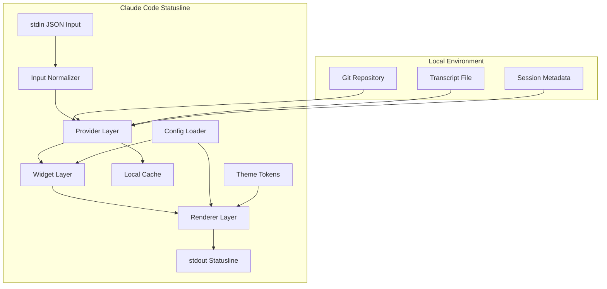
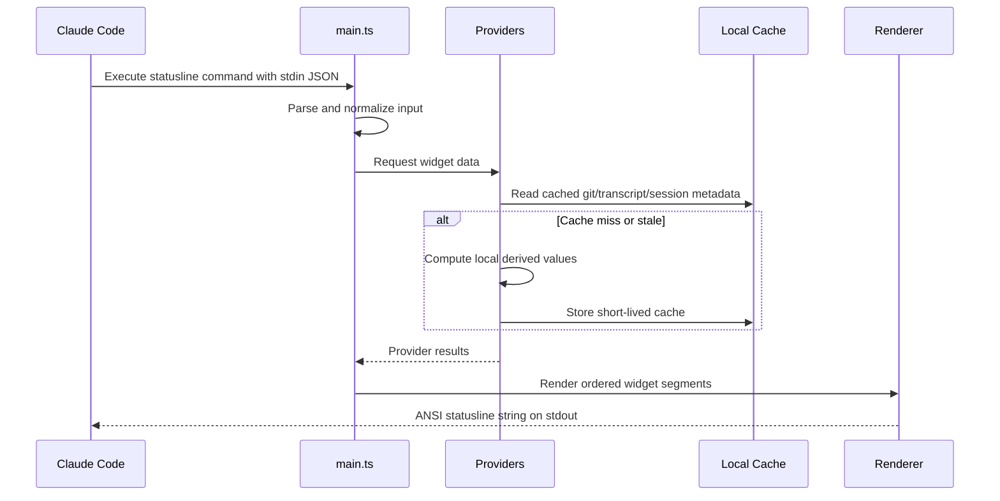
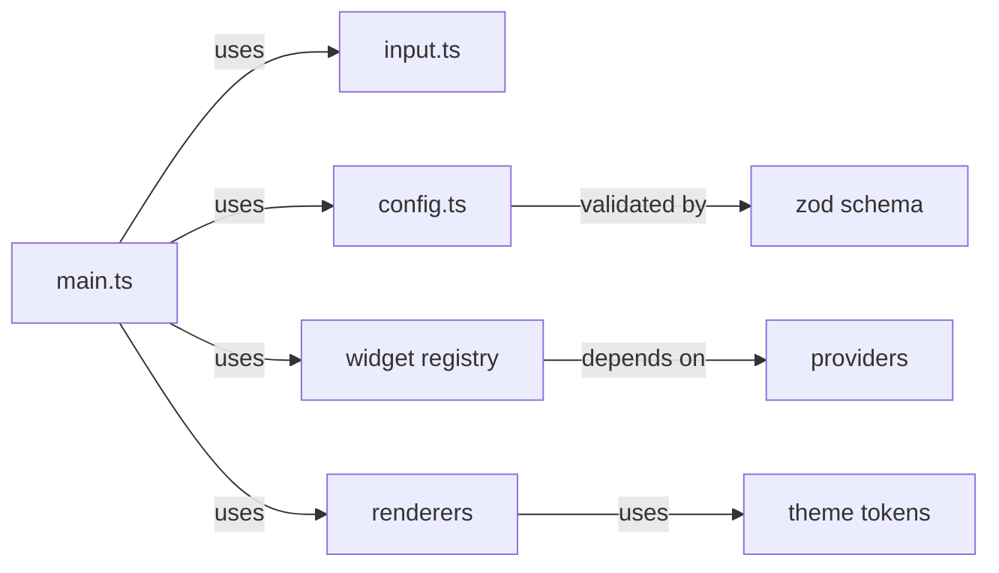

# Design: Claude Code Statusline

## Architecture Diagram



## Codebase Analysis

The current workspace is empty, which is an advantage for this project:

- No legacy architecture needs to be preserved.
- No prior runtime or packaging choice constrains the implementation.
- The design can be optimized for the desired statusline product instead of retrofitted.

External reference implementations show a clear pattern:

- A lightweight command-line entrypoint is sufficient for runtime integration.
- The most successful designs separate data collection from rendering.
- Statusline value comes from actionable context, especially model, git state, project identity, and session/context pressure.
- The main engineering risk is not rendering complexity; it is uncontrolled provider cost and ad hoc growth.

## Proposed Approach

Build the project as a local-first TypeScript CLI with four internal layers:

1. Input normalization
   Parse Claude Code JSON from `stdin` and normalize it into stable internal types.

2. Provider layer
   Resolve derived data from local sources such as git, transcript, and session metadata. Providers may use local cache.

3. Widget layer
   Transform normalized input and provider output into renderer-agnostic segments with labels, states, and semantic colors.

4. Renderer layer
   Convert segments into final terminal output. Start with `plain` and `powerline` renderers.

This design keeps visual sophistication in the renderer without coupling it to data acquisition or business logic.

## Data Flow



## Component Relationships



## Recommended File Structure

```text
src/
  main.ts
  types.ts
  input.ts
  config.ts
  theme.ts
  cache.ts
  providers/
    git.ts
    transcript.ts
    session.ts
  widgets/
    model.ts
    cwd.ts
    git.ts
    context.ts
    session.ts
    index.ts
  renderers/
    plain.ts
    powerline.ts
  utils/
    truncate.ts
    path.ts
    terminal.ts
```

## Detailed Design

### 1. Input Normalization

Responsibility:

- Read full `stdin`
- Parse JSON safely
- Normalize optional fields into one internal `StatuslineContext`

Why:

- Claude Code payload structure may evolve
- Widgets should not read raw JSON directly
- A normalization boundary contains compatibility logic in one place

### 2. Provider Layer

Responsibility:

- Fetch or derive local data
- Hide expensive or irregular external details from widgets
- Apply cache policy where needed

Planned providers:

- `git.ts`
  - branch
  - dirty state
  - maybe ahead/behind later

- `transcript.ts`
  - transcript path existence
  - last user prompt summary
  - coarse context pressure estimate

- `session.ts`
  - session elapsed time
  - usage summary from local metadata if available

Cache policy:

- Git metadata: short TTL cache
- Transcript-derived metadata: short TTL cache keyed by path and mtime
- Session metadata: compute cheap values directly when possible

### 3. Widget Layer

Responsibility:

- Convert raw or derived values into semantic display segments
- Decide display importance and fallback behavior
- Remain renderer-agnostic

Common widget output shape:

- `id`
- `text`
- `tone` such as neutral, info, warning, danger
- optional `icon`
- optional `priority`

This avoids coupling widget logic to a specific ANSI sequence strategy.

### 4. Renderer Layer

Responsibility:

- Lay out segments
- Apply style system
- Handle separator rules and fallback mode

Renderer plan:

- `plain`
  - minimal formatting
  - safe fallback
  - useful for debugging and compatibility

- `powerline`
  - polished segmented appearance
  - ANSI color blocks
  - support Nerd Font and ASCII fallback

Important constraint:

Do not push data logic into renderers. Renderers should only know how to present already-decided segments.

### 5. Config and Theme

Responsibility:

- Choose renderer
- Order widgets
- Enable/disable widgets
- Override theme tokens and behavior knobs

Recommended first config format:

- JSON for v1

Reason:

- Lowest parsing complexity
- No additional parser dependency
- Easy schema validation with `zod`

Possible future upgrade:

- JSONC if hand-editing ergonomics becomes a real issue

## Alternatives Considered

| Approach                                       | Pros                                                                          | Cons                                                                        | Rejected Because                                            |
| ---------------------------------------------- | ----------------------------------------------------------------------------- | --------------------------------------------------------------------------- | ----------------------------------------------------------- |
| Shell script with `bash` and `jq`              | fastest initial prototype, minimal tooling                                    | poor maintainability, hard to scale theme/widget system, brittle formatting | insufficient for the desired polish and long-term evolution |
| TypeScript local CLI with layered architecture | best balance of velocity, maintainability, polish, and packaging              | slower startup than compiled binary, needs Node runtime                     | recommended option                                          |
| Go local CLI with `lipgloss`                   | excellent performance, single binary distribution, strong terminal ergonomics | slower feature iteration, more rigid config/render evolution early on       | good future option, but not best for first implementation   |

## Key Decisions

- Runtime architecture: local CLI, not server-based
  - because the statusline command model already fits Claude Code's integration point and avoids unnecessary operational complexity

- Implementation language: TypeScript
  - because it offers the best balance of iteration speed and maintainable abstraction for widgets and renderers

- UI strategy: ANSI-rendered text, no TUI framework
  - because the product is a rendered statusline, not an interactive terminal app

- Rendering model: renderer abstraction with semantic widget segments
  - because it keeps styling sophistication separate from data logic

- Data strategy: local providers plus short-lived cache
  - because transcript and git data can become expensive if recomputed naively

## Dependencies & Risks

| Risk                                                    | Likelihood | Impact | Mitigation                                                        |
| ------------------------------------------------------- | ---------- | ------ | ----------------------------------------------------------------- |
| Transcript parsing cost becomes noticeable              | medium     | high   | cache by path and mtime, keep context estimation coarse in v1     |
| ANSI layout breaks with wide characters or icons        | medium     | medium | use `string-width`, add ASCII fallback mode                       |
| Input payload shape changes across Claude Code versions | medium     | medium | isolate compatibility logic in `input.ts` normalization           |
| Session cost metric is not reliably derivable locally   | medium     | medium | treat session widget as pluggable and allow elapsed-time fallback |
| Design scope creeps toward a full product too early     | high       | high   | keep v1 to five widgets, two renderers, one config format         |

## Files Affected

- `package.json` — project scripts and dependencies
- `tsconfig.json` — TypeScript configuration
- `src/main.ts` — CLI entrypoint
- `src/types.ts` — shared internal types
- `src/input.ts` — stdin parsing and normalization
- `src/config.ts` — config loading and validation
- `src/theme.ts` — theme token definitions
- `src/cache.ts` — local cache utilities
- `src/providers/git.ts` — git provider
- `src/providers/transcript.ts` — transcript-derived provider logic
- `src/providers/session.ts` — session provider logic
- `src/widgets/model.ts` — model widget
- `src/widgets/cwd.ts` — cwd widget
- `src/widgets/git.ts` — git widget
- `src/widgets/context.ts` — context widget
- `src/widgets/session.ts` — session widget
- `src/widgets/index.ts` — widget registry and ordering
- `src/renderers/plain.ts` — plain renderer
- `src/renderers/powerline.ts` — polished renderer
- `README.md` — setup and usage documentation

---

_Generated by Claude 一人公司 — pipeline Stage 2: Design_
